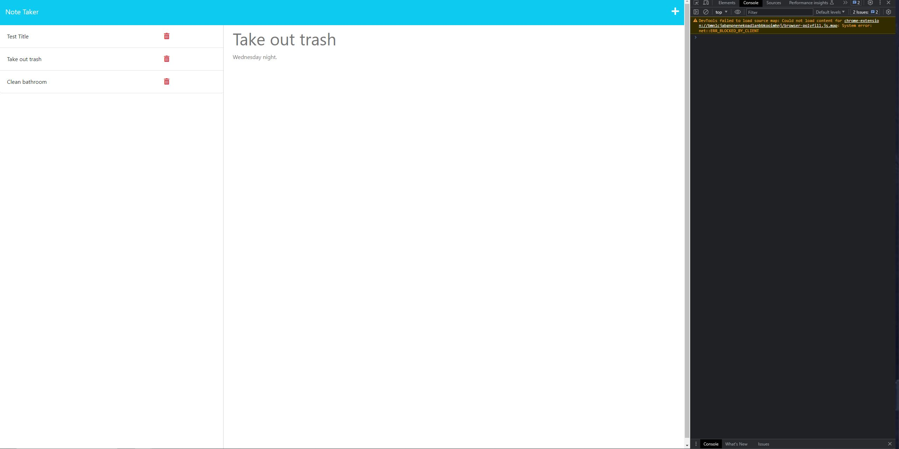

# Express Note Taker 

## Description

An application that can be used to write and save notes called Express Note Taker. This application will use an Express.js back end and will save and retrieve note data from a JSON file.

# Installation

Please install the following to properly run/create a similar application.

vsCode

Node.js

Express.js

git

## Usage

An easy way to jot down notes that will remain on the page. You can remove any notes that are no longer viable by deleting along with viewing older notes. 

## Credits

N/A

## License

GNUv3

## Technologies

JavaScript
Node.js
Express.js
Heroku

## Questions

Please email me at james.brainard2@aol.com for any questions or collaboration ideas.

## Link to deployed site

https://immense-shore-33393-7933ff522b8f.herokuapp.com/

## Screenshot of Application

